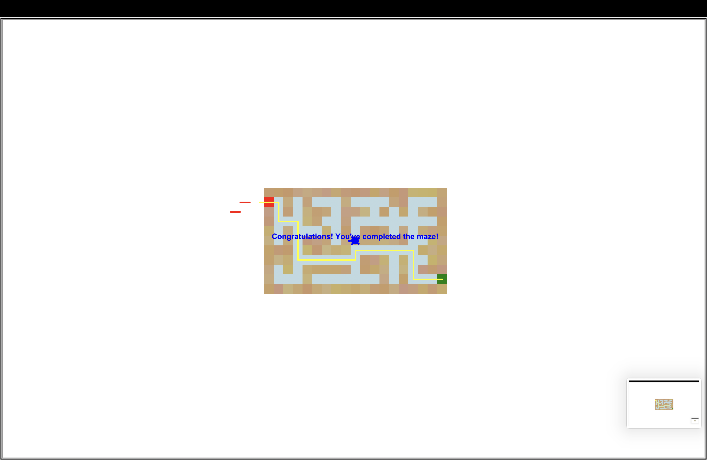

# python_maze_game
A Python-based Turtle Maze Game
##  Tools & Concepts
- Python
- Turtle graphics
- 2D arrays & file I/O
- Coordinate transformations
- Event-driven programming

---

##  Features
- Maze read from external `.txt` files with customizable symbols
- Keyboard-controlled turtle (arrow keys) with animated path
- Color-coded maze visualization (walls, roads, entrance, exit)
- Displays "Congratulations!" message upon completion

---

##  Screenshot

Here’s a solved maze with the turtle's path:



---

##  How to Run

1. Download or clone this repo
2. Run:

```bash
python Assignment_5.py
